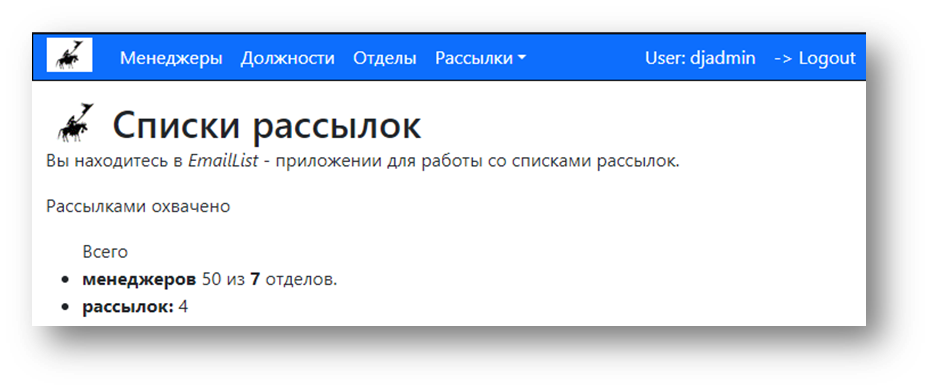
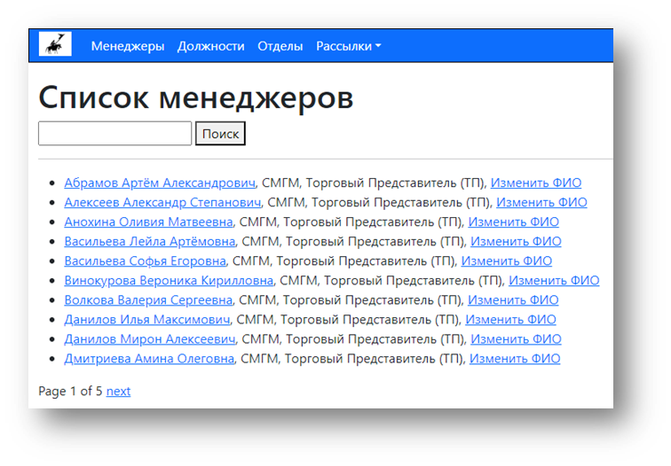

## Проект по курсу Python Basic
### Рабочий прототип Django-PostgreSQL-Boostrap приложения

*Python 3.11, Django 4.2*

В папке **docs** располагается краткая сопроводительная презентация: **К проекту 20231204.pptx**


### Структура каталога

```
pybas-202305
├── py-bas-django/
│   ├── .github
│   │   └── workflows            # pylint
│   ├── docs
│   │   ├── istructions4docker   # инструкция по запуску MS SQL Server в docker
│   │   ├── repaire_migrations   # полный ремонт миграций
│   │   └── К проекту 20231204   # презентация к проекту (очень краткая)
│   ├── ms_sql_server            # набор файлов к запуску MS SQL Server в docker
│   ├── PostgreSQL               # набор файлов к запуску PostgreSQL в docker
│   ├── sql                      # скрипты для генерации данных
│   └── nomad                    
│       ├── emaillist            # ПРИЛОЖЕНИЕ
│       │   ├── tests            # тесты
│       └── ...                  
├── .gitignore
├── poetry.lock 
├── pyproject.toml
└── README.md
```

### Иллюстрации
<details>
<summary>Внешний вид приложения</summary>





</details>

### Команды

Запуск/остановка докера
```bash
cd PostgreSQL
docker compose -f docker-compose-local.yml up
docker compose -f docker-compose-local.yml down -v
```
Подготовка и накат миграций
```bash
python manage.py makemigrations emaillist
python manage.py migrate emaillist
```
Запуск сервера и создание суперпользователя
```bash
python manage.py runserver 
python manage.py createsuperuser
```

Дополнительно
<details>
<summary>Учебные и справочные материалы</summary>

- [Tutorial](https://docs.djangoproject.com/en/5.0/intro/tutorial01/) djangoproject.com
- [Education materials](https://developer.mozilla.org/ru/docs/Learn/Server-side/Django/Generic_views) mozilla.org
- [Django many-to-many](https://www.programmersought.com/article/45815686539/) fully automatic, pure hand, semi-automatic (recommended)
- [django-listing](https://github.com/elapouya/django-listing)
- [PGAdmin](https://www.pgadmin.org/)
- [Pallete for ```#0150b5``` color schema](https://get-color.ru/code/0150b5)

</details>